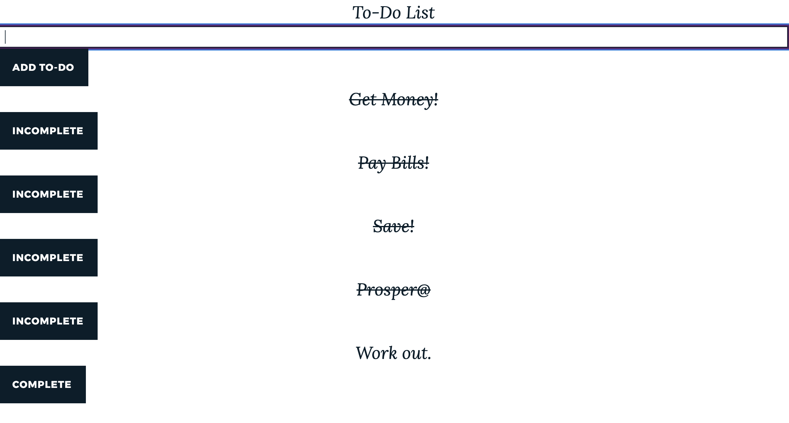

# :checkered_flag:What It Looks Like :checkered_flag:: 

# How It's Made :nut_and_bolt:🔨 :hammer::wrench::
 This application built with React.js, TypeScript, Node, Webpack, & Babel.

## Optimizations.
Install Passport.

 # How It's Works:white_check_mark::
1.) A user can submit a todo task.

2.) A user can Mark it complet or incomplete.

## Lessons Learned :mortar_board::

I learn how to setup my React.js app without pre config create-react-app and build my own app using Webpack and Babel. I also learn how to use TypeScript and its features like type, intertace, defining what a HTML element to expect. Using React hooks like useState.
 
# My Awesome Project

# Portfolio :open_file_folder::

** :computer:   WEBSITE:** [John Fleurimond](http://johnfleurimond.com)

# How To Get It Started :arrow_forward: :

## Installation

1. Clone repo
2. run `npm install`

## Available Scripts

In the project directory, you can run:

### `npm start`

Runs the app in the development mode. 
Open [http://localhost:5000](http://localhost:5000) to view it in the browser.

The page will reload if you make edits. 
You will also see any lint errors in the console.

